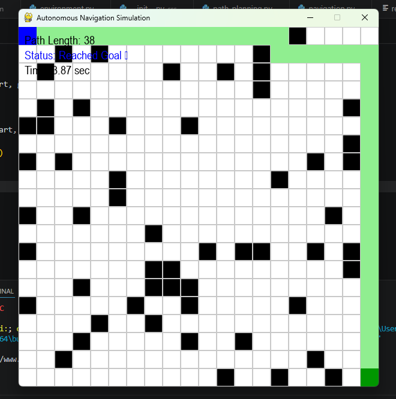

## 📌 Project Overview
The AI-Based Autonomous Navigation System is a simulation project that demonstrates how a robot or self-driving vehicle can navigate autonomously in an environment while avoiding obstacles.

The system uses a grid-based virtual environment where an intelligent agent calculates the optimal path from a start point to a destination using the A* (A-Star) path planning algorithm.

This project mimics real-world autonomous systems used in robotics, self-driving cars, warehouse automation, and smart mobility solutions, making it a strong proof-of-work for AI and robotics applications.

## 🚀 Features
- 🧭 Autonomous navigation from start to goal
- 🧱 Grid-based environment simulation
- 🚧 Dynamic obstacle placement
- 🧠 A* (A-Star) path planning algorithm
- 📍 Shortest path calculation
- 🎯 Goal-based navigation system
- 🖥️ Real-time visualization using Pygame
- 🔄 Modular and scalable code structure
- 📊 Path visualization for better understanding

## ⚙️ Tech Stack
- **Programming Language:** Python  
- **Simulation:** Pygame  
- **Algorithms:** A* (A-Star Path Planning)  
- **Libraries:** NumPy  
- **Development Tool:** VS Code  
- **Version Control:** Git & GitHub  

## 📁 Project Structure
AI-Autonomous-Navigation-System/
│
├── simulation/
│ ├── init.py
│ └── environment.py 
│
├── src/
│ ├── init.py
│ ├── path_planning.py 
│ └── navigation.py 
│
├── outputs/
│ ├── images/ 
│ └── videos/ 
│
├── main.py 
├── requirements.txt 
├── .gitignore 
└── README.md 

## 📸 Screenshots

